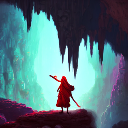

# Caves of Qud - Custom Soundtrack

Catch your breath while trekking a Desert Canyon, feel your blood boil inside a Lair, get lost into a psychodelic dream between Rainbow Woods…

Ever in games, stayed console open at a location just because the music there moves you? If you never did, I hope to give the same feeling to you with my selection.

Custom Soundtrack includes a lot of themes from many roguelikes. The OG, the best, Mystery Dungeon of course (PMD but also Shiren the Wanderer, even some Etrian and Chocobo's Dungeon! ) and many others like Elona, The Binding of Isaac (the roguelikest roguelite), Tangledeep, even Touhou through Genso Wanderer, and more.

- Enjoy 300+ themes passionately chosen for each location and regions. Each place has its own handcrafted playlist, playing at random sometimes when you enter a zone, change screens, go up/down stairs
- Region and Tier based music: A village in Hills won't sound like Lake Hinnom, an early game Tier 1 Historic Site will be very different from a late game one. As you get to more and more advanced places, music will become more complex, sometimes more epic, sometimes more sad - soundtrack can and I hope will tell a story.
- Includes a timer preventing you from having to hear multiple track changes if you travel rapidly in a same location
- Tamed the huge crossfade effect base Qud uses
- Provided a patch for the few locations that actually don't play music any different from the region they're in, like the Stiltgrounds.
- And last but not least, includes instructions on how you can add your own themes to create your own Custom Soundtrack! Check them out [here](AddYourOwn.md).

**Note**:

If you play for quite a time on latest Beta or Stable, you'll eventually crash because the base game doesn't actually support streaming songs. It is entirely fixed in the (huge) upcoming Moon Stair update.

I can't recommand enough you use good EQ and audio settings to be fully
immersed in any music. Check mine
[here](AddYourOwn.md#optional-using-audio-enhancement-software)

Check Credits [here](Credits.md)
